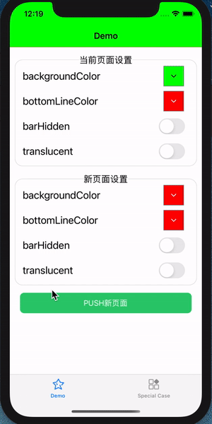
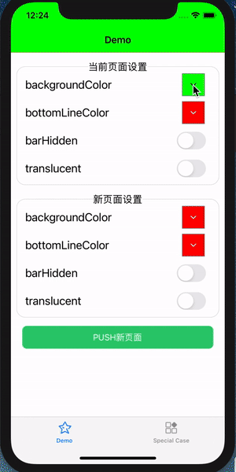

# QDNavigationBar

[](https://travis-ci.org/sinno93/QDNavigationBar)
[](https://cocoapods.org/pods/QDNavigationBar)
[](https://cocoapods.org/pods/QDNavigationBar)
[](https://cocoapods.org/pods/QDNavigationBar)

QDNavigationBar是一个轻量、易用导航栏样式管理库，它可以帮助你为每个控制器定义自己的导航栏样式，这一切只需要几行代码即可做到！

 

## 特性
- [x] 让每一个控制器都能定制自己想要的导航栏样式
- [x] 轻量、低耦合，数行代码即可集成
- [x] 支持设置多种自定义的样式比如:背景颜色、背景图片、导航栏底部线条颜色、是否有半透明效果、透明度等
- [x] 支持选择导航栏切换时的过渡效果
- [x] 支持large title、带search bar等特殊的导航栏模式
- [x] 支持dark mode
- [x] 支持横竖屏切换 


## Requirements
- iOS 9.0+ 
- Xcode 11.0+
- Swift 4.0+

## Installation

QDNavigationBar is available through [CocoaPods](https://cocoapods.org). To install
it, simply add the following line to your Podfile:

```ruby
pod 'QDNavigationBar'
```

## Usage

#### Swift

###### 1.导入QDNavigationBar
```swift
import QDNavigationBar
```

###### 2.为你的UINavigationController开启QDNavigationBar配置功能

```swift
let config = QDNavigationBarConfig()
config.backgroundColor = UIColor.green
navController.qd_navBarConfig = config
```

设置UINavigationController的qd_navBarConfig的有两个作用：

1.启用QDNavigationBar管理(也就是说，不设置则不启用)

2.配置该导航控制器的默认导航栏样式配置，对于该导航控制器管理下的所有未设置自定义配置的控制器生效。


通常情况下，一个app内的大部分页面的导航栏配置都是一样的，可以将这些设置为导航控制器的qd_navBarConfig。

对于少数页面需要设置特殊的样式，可以为其单独设置qd_navBarConfig，如下：


##### 3. 为某些UIViewController设置特殊配置

```swift
override func viewDidLoad() {
        super.viewDidLoad()
  			// 配置导航栏样式，仅针对当前控制器有效
        let config = QDNavigationBarConfig()
        config.backgroundColor = UIColor.blue
        self.qd_navBarConfig = config
    }
```

默认情况下，UIViewController的qd_navBarConfig为nil, 此时该控制器的导航栏样式由其导航栏控制。

1. 在你为控制器设置了qd_navBarConfig后，该控制器的导航栏样式将根据自己的配置显式。
2. 你可以随时修改qd_navBarConfig设置的配置，这些配置会实时生效。


##### 4. QDNavigationBarConfig支持的配置

```swift
/// 导航栏背景颜色
/// 默认白色(UIColor.white)
@objc public var backgroundColor: UIColor

/// 导航栏背景图片
/// 默认nil
@objc public var backgroundImage: UIImage?

/// 导航栏背景透明度
/// 默认1.0
/// 注意此属性仅影响导航栏背景的透明度，不会影响导航栏上的控件(比如标题、返回键...)
@objc public var alpha: CGFloat

/// 是否需要模糊效果
/// 默认false，即不需要
/// 设置为true后，可通过blurStyle控制模糊效果样式
@objc public var needBlurEffect: Bool

/// 模糊效果样式
/// 默认.light
/// 在needBlurEffect为true时，此属性有效
@objc public var blurStyle: UIBlurEffect.Style

/// 导航栏底部线条颜色
/// 默认透明(UIColor.clear)
@objc public var shadowLineColor: UIColor

/// 导航栏是否隐藏
/// 默认false，即不隐藏
@objc public var barHidden: Bool

/// 否开启导航栏事件穿透，
/// 默认为false,即不会穿透; 当设置为为true时，点击导航栏背景的事件会透到下层视图
/// 注意，如果导航栏上有标题、返回按钮等时，点击这些控件的事件不会被穿透
/// 增加这个属性是考虑到一种情况：当你将导航栏设置为透明时，
@objc public var eventThrough: Bool

/// 两个视图控制器切换(push/pop)时的样式
/// 默认.automatic
@objc public var transitionStyle: TransitionStyle
```


## Notes

当你为一个UINavigationController启用了QDNavigationBar管理后，不要再调用导航栏的setBackgroundImage等样式修改方法了，

你应该使用qd_navBarConfig进行配置。

## Author

sinno93, sinno93@qq.com

## License

QDNavigationBar is available under the MIT license. See the LICENSE file for more info.
