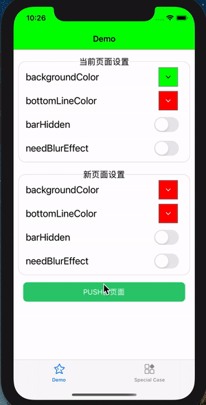

# QDNavigationBar

[](https://travis-ci.org/sinno93/QDNavigationBar)
[](https://cocoapods.org/pods/QDNavigationBar)
[](https://cocoapods.org/pods/QDNavigationBar)
[](https://cocoapods.org/pods/QDNavigationBar)

QDNavigationBar是一个轻量、易用导航栏样式管理库，它可以帮助你为每个控制器定义自己的导航栏样式，这一切只需要几行代码即可做到！

 

## 特性🌟
- [x] 让每一个控制器都能定制自己想要的导航栏样式
- [x] 轻量、低耦合，数行代码即可集成
- [x] 支持设置多种自定义的样式比如:背景颜色、背景图片、底部线条颜色、是否有半透明效果、透明度等
- [x] 支持选择导航栏切换时的过渡效果
- [x] 支持large title模式
- [x] 支持dark mode
- [x] 支持横竖屏切换 


## Requirements💡
- iOS 9.0+ 
- Xcode 11.0+
- Swift 4.0+

## Installation👷‍♂️

QDNavigationBar is available through [CocoaPods](https://cocoapods.org). To install
it, simply add the following line to your Podfile:

```ruby
pod 'QDNavigationBar'
```

## Usage🧭

###### 1.导入QDNavigationBar

```swift
/// Swift:
import QDNavigationBar
```

```objective-c
/// Objective-C
@import QDNavigationBar;
```

###### 2.为UINavigationController开启QDNavigationBar支持

QDNavigationBar通过Runtime为UINavigationController增加了一个实例属性navBarConfig，只需要给该属性赋值即可开启QDNavigationBar支持。

```swift
/// Swift
let config = QDNavigationBarConfig()
config.backgroundColor = UIColor.green
navigationController.navBarConfig = config
```

```objective-c
/// Objective-C

```

>UINavigationController实例级别的控制，可以灵活控制QDNavigationBar的作用范围：你可以自由控制哪些导航控制器需要使用QDNavigationBar来管理导航栏样式，哪些不需要；
>
>一般来说，项目中都会有一个自定义的导航控制器，你可以在那个类中进行相关设置，这样你不需要为每个实例都进行设置。

UINavigationController的navBarConfig作为导航栏默认样式配置，如果topViewController没有自己的配置，该默认配置将生效。


##### 3. 为某些UIViewController设置独立的导航栏样式配置

同样的，QDNavigationBar也为UIViewController增加了一个实例属性navBarConfig。

> 默认情况下，UIViewController的navBarConfig为nil, 此时该控制器的导航栏样式由其导航栏的navBarConfig决定；
>
> 在实际项目中，一般只有少数页面需要设置特殊的样式，可以为其单独设置navBarConfig来实现。

```swift
override func viewDidLoad() {
        super.viewDidLoad()
  			// 配置导航栏样式，仅针对当前控制器有效
        let config = QDNavigationBarConfig()
        config.backgroundColor = UIColor.blue
        self.navBarConfig = config
    }
```


总结一下:

1.如果当前显示的控制器navBarConfig为nil, 则导航栏样式则由导航控制器的navBarConfig决定；

2.如果当前显示的控制器的navBarConfig不为nil, 则导航栏样式则由该配置决定。

修改控制器或者导航控制器的navBarConfig的任意属性，都将实时生效。

##### 4. QDNavigationBarConfig支持的配置

```swift
/// 导航栏背景颜色
/// 默认白色(UIColor.white)
@objc public var backgroundColor: UIColor

/// 导航栏背景图片
/// 默认nil
@objc public var backgroundImage: UIImage?

/// 导航栏背景透明度
/// 默认1.0
/// 注意此属性仅影响导航栏背景的透明度，不会影响导航栏上的控件(比如标题、返回键...)
@objc public var alpha: CGFloat

/// 是否需要模糊效果
/// 默认false，即不需要
/// 设置为true后，可通过blurStyle控制模糊效果样式
@objc public var needBlurEffect: Bool

/// 模糊效果样式
/// 默认.light
/// 在needBlurEffect为true时，此属性有效
@objc public var blurStyle: UIBlurEffect.Style

/// 导航栏底部线条颜色
/// 默认透明(UIColor.clear)
@objc public var bottomLineColor: UIColor

/// 导航栏是否隐藏
/// 默认false，即不隐藏
@objc public var barHidden: Bool

/// 否开启导航栏事件穿透，
/// 默认为false,即不会穿透; 当设置为为true时，点击导航栏背景的事件会透到下层视图
/// 注意，如果导航栏上有标题、返回按钮等时，点击这些控件的事件不会被穿透
@objc public var eventThrough: Bool

/// 两个视图控制器切换(push/pop)时导航栏样式切换动画
/// 默认.automatic
@objc public var transitionStyle: TransitionStyle
```

>QDNavigationBar不会为你管理诸如返回按钮、标题颜色、顶部菜单等，有两个原因：
>
>1.这些都可以通过UIViewController的navigationItem进行设置
>
>2.作者希望QDNavigationBar能够专注于解决导航栏"公地悲剧"问题，尽量不添加非必要功能🧐

## Notes⚠️

注意事项：

当为一个UINavigationController启用QDNavigationBar管理后：

​	1.不要调用navigationBar的 setBackgroundImage、shadowImage方法

​	2.不要调用UINavigationController的setNavigationBarHidden方法

​	3.注意navigationBar的translucent将为true， 并且你不应该修改它


## Author👨🏻‍💻

联系邮箱📮： sinno93@qq.com

🎉有任何问题和建议，欢迎提issues或 pull request！🎉

如果QDNavigationBar对你有帮助，请点亮一下Star，非常感谢🤩

## License🧙‍♂️

QDNavigationBar is available under the MIT license. See the LICENSE file for more info.
